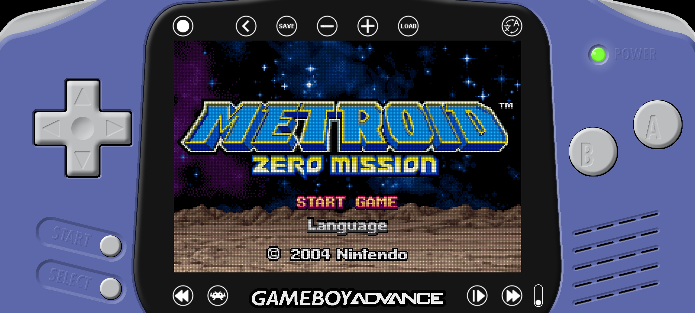

# GameBoy Advance Overlay

This is a GameBoy Advance overlay for RetroArch, made for modern 21:9 (2400x1080) screen Android devices.

I'm open to suggestions!

# Installation

<b>1.</b> Download latest release.

<b>2.</b> Extract and copy the <b>gba</b> folder inside: 
<i>"RetroArch/overlays/misc"</i> (Or any folder you set for overlays in RetroArch settings) and overwrite if asked.

<b>3.</b> Open RetroArch and boot any GBA game (the mGBA core is recommended), go into the menu and change these settings:

<b>Video:</b>
- Enable fullscreen over notch in Android devices <b>"ON"</b>

<b>Video -> Scaling:</b>
- Integer Scale <b>"ON"</b>
- Aspect Ratio <b>"Custom"</b>
- Custom Aspect Ratio (Width) <b>"1200 (5x)"</b>
- Custom Aspect Ratio (Height) <b>"800 (5x)"</b>
- Crop Overscan (Restart Required) <b>"ON"</b>

<b>On-Screen Display -> On-Scren Overlay:</b>
- Display Overlay <b>"ON"</b>
- Auto-Scale Overlay <b>"OFF"</b>
- Overlay Preset <b>"gba"</b> (Select the <b>gba.cfg</b> file found in <b>gba</b> folder)
- Overlay Opacity <b>"1.00"</b>
- (Landscape) Overlay Scale <b>"1.000"</b>
  
<b>4.</b> Go to <b>Quick Menu -> Ovverides</b> and <b>Save Core Overrides</b> then restart RetroArch.
 
<b>5.</b> Play!

<b>NOTE:</b>
<b>THESE SETTINGS ARE OPTIMAL FOR 21:9, 2400x1080 RESOLUTION PHONES, FOR DIFFERENT ASPECT RATIO AND RESOLUTIONS YOU MAY HAVE TO TWEAK SOME SETTINGS.</b>
  
<b>Optional Settings:</b>
  
If you use mGBA core i reccomend this core options:
- Use BIOS File if Found (Restart) <b>"ON"</b> (If you have BIOS files)
- Skip BIOS Intro (Restart) <b>"OFF"</b>
- Color Correction <b>"Game Boy Advance"</b>
- Interframe Blending <b>"LCD Ghosting (Accurate)"</b>
- Low Pass Filter <b>"ON"</b>
  
I also reccomed using a <b>Video Shader</b> like <b>dot.glslp</b> found in <i>"shaders_glsl/handheld/"</i> (Or <i>"shadrs_slang/handheld/dot.slangp"</i> if you use Vulkan video driver)

# Usage

<b>NOTE: Rewind and AI Service must be configured in RA settings to make them work in the overlay!</b>

Touch the GameBoy Advance (or the Libretro RetroArch Logo if you use the alternative background) logo to make all function buttons invisible (they can stil be pressed), touch again to make them visible.

# Donation
If you like my work, please consider a small donation.

You can donate with <a href="https://paypal.me/maestrosistema?country.x=IT&locale.x=it_IT"><b>PayPal</b></a> or <a href="https://ko-fi.com/maestrosistema"><b>Ko-Fi</b></a>.

Thank You!

# Special Thanks
RetroArch Team

# Disclaimer
<b>Nintendo GameBoy</b> is a trademark of <b>Nintendo Co., Ltd</b>

<b>Android</b> is a trademark of <b>Google LLC</b>
